# Medical Image Classification with Custom CNNs, Transfer Learning, and XAI

[](https://www.python.org/)
[](https://pytorch.org/)
[](https://pytorch.org/)
[](https://scikit-learn.org/)
[](https://captum.ai/)
[](https://github.com/Hamzasher02/AneRBC-based-project)
[](#)
[](#)

---

## 📌 Project Overview
This repository contains an end-to-end medical image classification pipeline developed for the **AneRBC** blood smear dataset to classify cells as **healthy** or **anaemic**. The project covers raw dataset loading, cleaning, stratified data splitting, custom Deep CNN development from scratch, pretrained backbone transfer learning (fine-tuning frozen feature extraction layers), comprehensive metric evaluation, and Explainable AI (XAI) visual attributions.

---

## 📅 Project Completion Status

| Stage / Task | Description | Status |
| :--- | :--- | :---: |
| **Task 1: Dataset Pipeline** | Data cleaning, structure validation, preprocessing, and stratified splitting. | **Completed** |
| **Task 2: Custom CNNs** | Architectures with 3, 4, and 5 convolutional layers trained from scratch. | **Completed** |
| **Task 3: Transfer Learning** | Fine-tuning pretrained MobileNetV2, SqueezeNet 1.0, and ResNet18. | **Completed** |
| **Task 4: Explainable AI** | Attribution heatmaps via Grad-CAM and Integrated Gradients. | **Completed** |
| **Task 5: Deliverables** | Submission reports and runnable Jupyter Notebooks. | **Completed** |

---

## ⚙️ Workflow Architecture

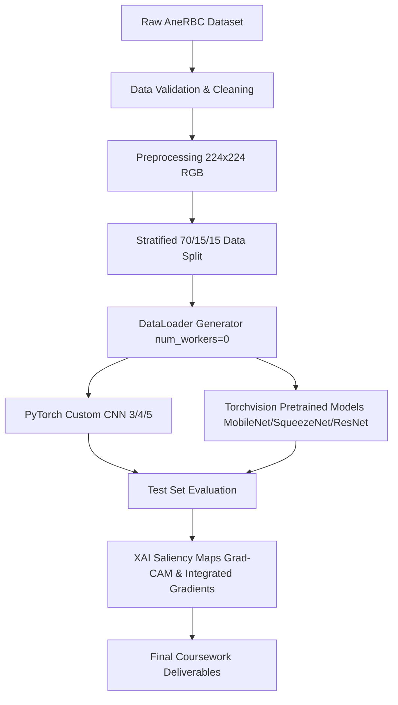

---

## 📊 Dataset Distribution
The **AneRBC** dataset consists of **1,000 images** split equally between the healthy and anaemic classes:
- **Healthy cells:** 500 images
- **Anaemic cells:** 500 images

During preprocessing (Task 1.3), data was split into a stratified **70/15/15** ratio:
- **Train Set:** 700 images (350 healthy, 350 anaemic)
- **Validation Set:** 150 images (75 healthy, 75 anaemic)
- **Test Set:** 150 images (75 healthy, 75 anaemic)

<p align="center">
  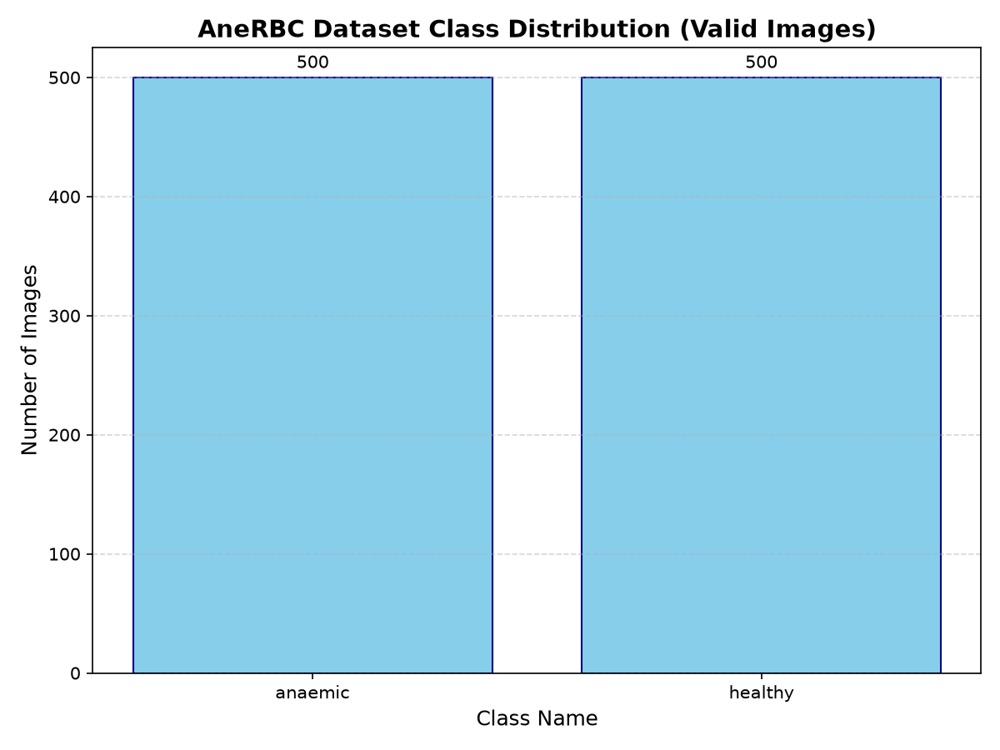
</p>

---

## 📈 Experimental Results & Model Performance

### 1. Custom CNN Architectures (Task 2)
Three custom architectures were trained from scratch on CPU using Adam optimizer and ReduceLROnPlateau scheduler. Early stopping was set to `patience=8`.

| Model Name | Conv Layers | Test Accuracy | Precision (Macro) | Recall (Macro) | F1-Score (Macro) | ROC-AUC |
| :--- | :---: | :---: | :---: | :---: | :---: | :---: |
| `custom_cnn_3` | 3 | 59.33% | 0.5984 | 0.5933 | 0.5880 | 0.6315 |
| `custom_cnn_4` | 4 | **66.67%** | **0.6769** | **0.6667** | **0.6618** | **0.6967** |
| `custom_cnn_5` | 5 | 62.67% | 0.6267 | 0.6267 | 0.6267 | 0.6873 |

<p align="center">
  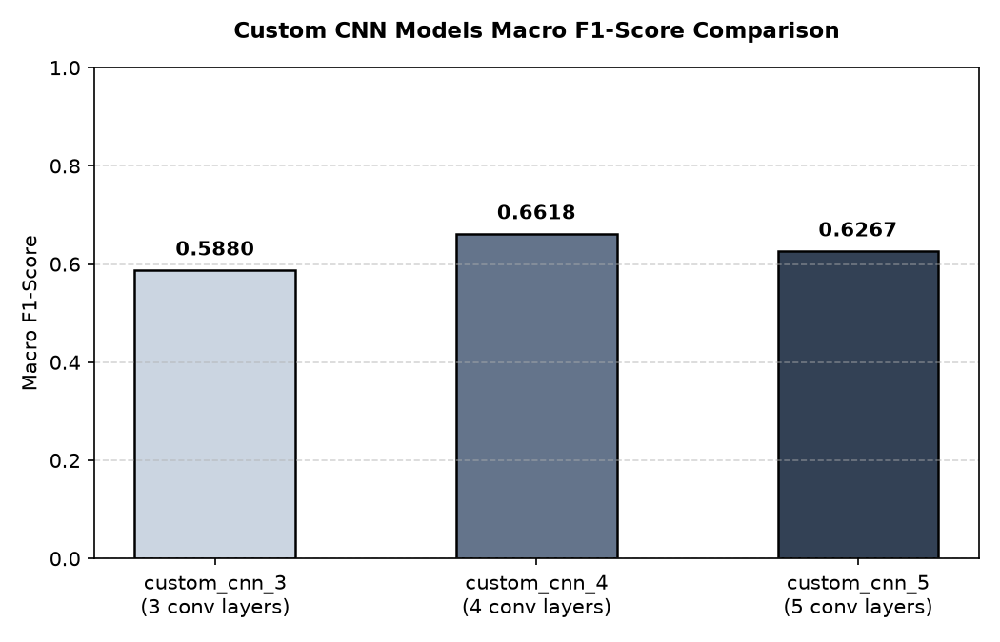
</p>

* **Best Custom Model:** `custom_cnn_4` (4 convolutional layers, FC head of 512 units). 
* **Validation Evidence:**
  <p align="center">
    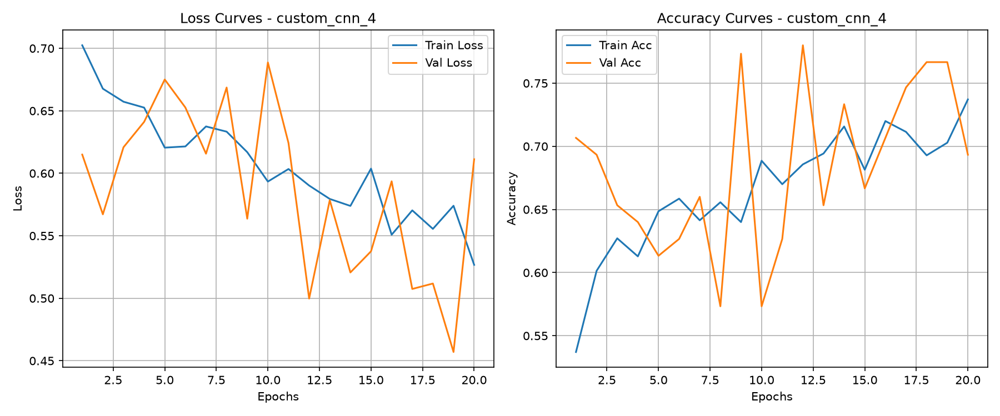
    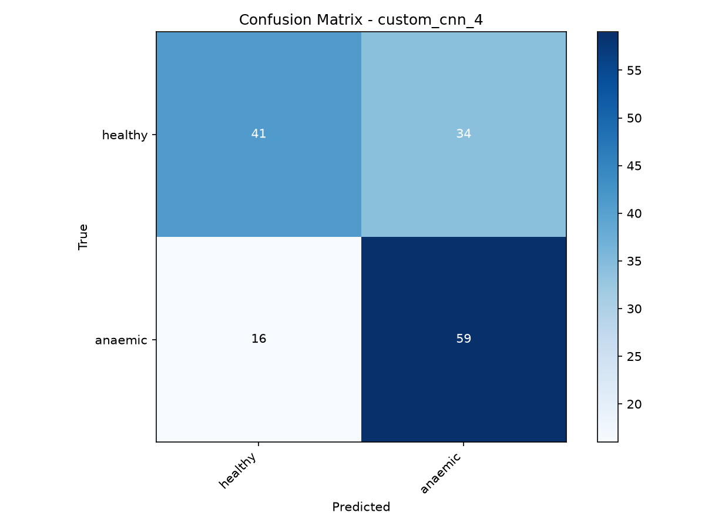
  </p>

---

### 2. Pretrained Models via Transfer Learning (Task 3)
Pretrained Torchvision backbones were fine-tuned as feature extractors by freezing all convolutional layer weights (`requires_grad = False`) and training only custom-built classifier heads. Early stopping was set to `patience=6`.

| Model Name | Test Accuracy | Precision (Macro) | Recall (Macro) | F1-Score (Macro) | ROC-AUC |
| :--- | :---: | :---: | :---: | :---: | :---: |
| `mobilenet_v2` | **75.33%** | **0.7707** | **0.7533** | **0.7493** | 0.8228 |
| `squeezenet1_0` | 74.00% | 0.7421 | 0.7400 | 0.7394 | **0.8455** |
| `resnet18` | 70.00% | 0.7083 | 0.7000 | 0.6970 | 0.8084 |

<p align="center">
  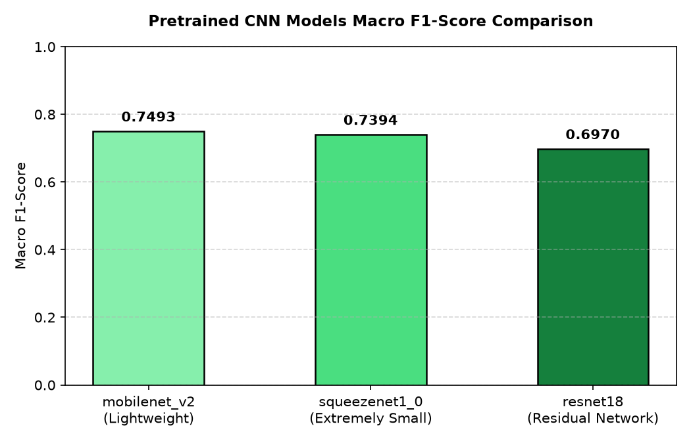
</p>

* **Best Pretrained Model:** `mobilenet_v2` (highest test accuracy and macro F1).
* **Validation Evidence:**
  <p align="center">
    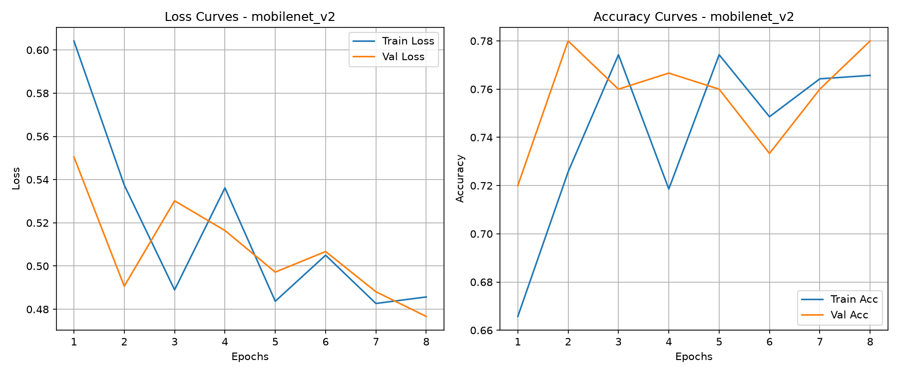
    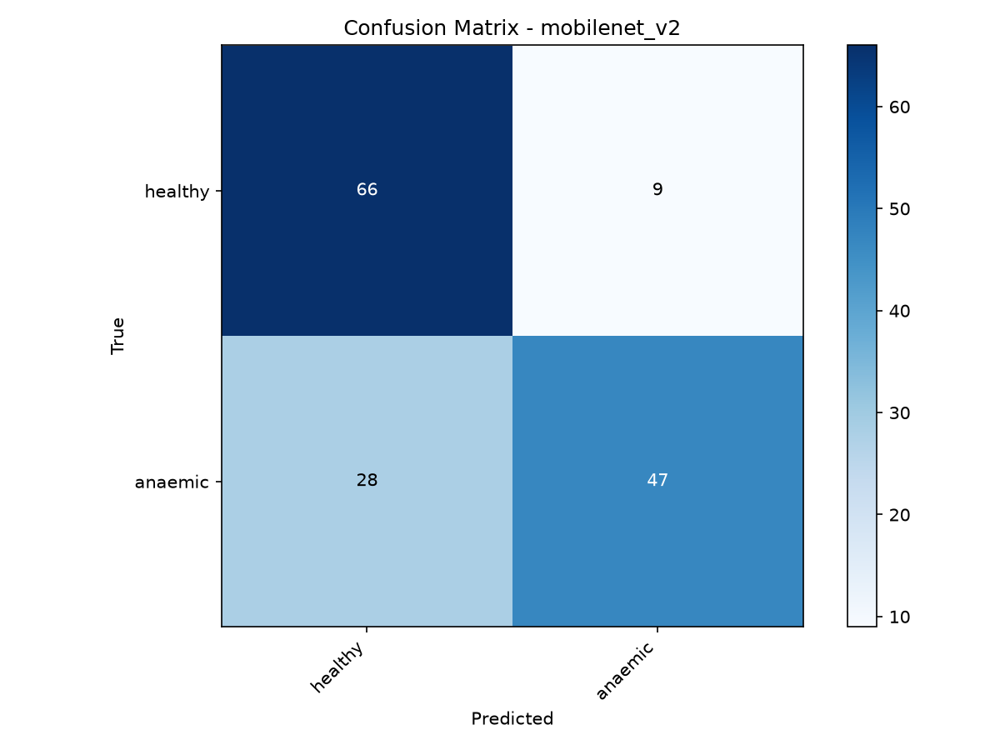
  </p>

---

### 3. Custom vs. Pretrained Comparison

<p align="center">
  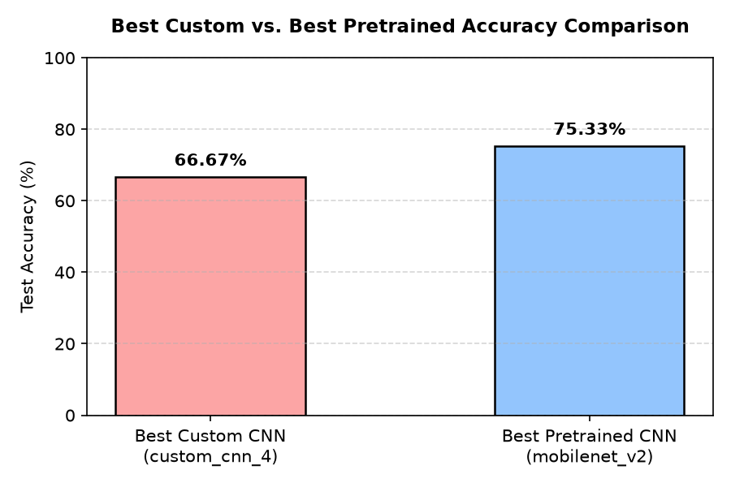
</p>

Fine-tuning pretrained backbones like **MobileNetV2** significantly outperforms custom architectures trained from scratch on this small-scale clinical dataset (700 training samples), demonstrating the power of pre-extracted ImageNet feature visual weights.

---

## 🔍 Explainable AI (XAI) Visualisations (Task 4)
Attributions were computed for the best custom model (`custom_cnn_4`) and the best pretrained model (`mobilenet_v2`) using **Grad-CAM** (coarse layer-based activations) and **Integrated Gradients** (fine pixel-level gradients).

#### 1. Custom CNN 4 Attributions:
<p align="center">
  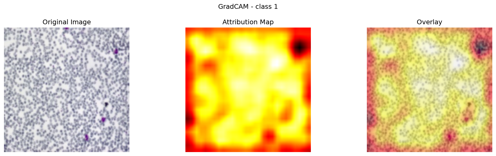
  <br />
  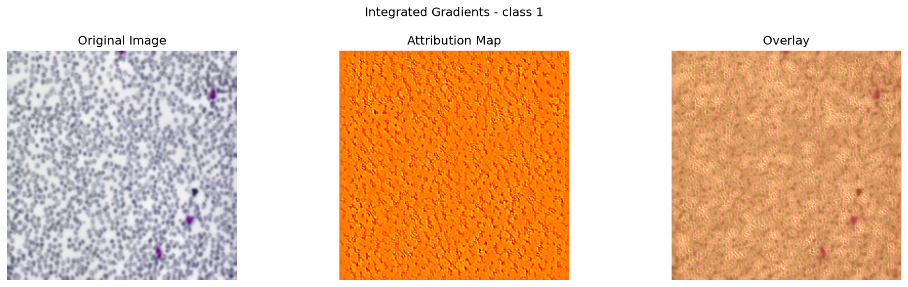
</p>

#### 2. MobileNetV2 Attributions:
<p align="center">
  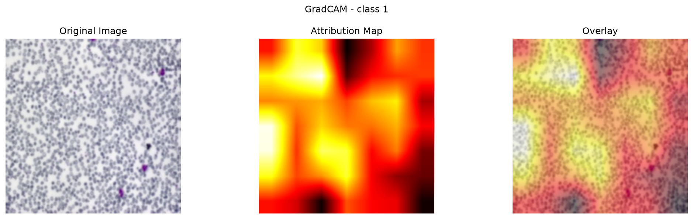
  <br />
  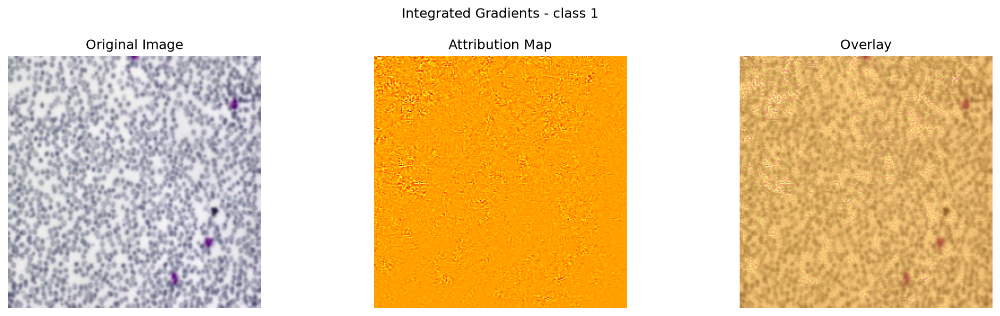
</p>

- **Clinical Interpretation:** Saliency overlay maps show that the models focus attributions heavily on the cell boundary regions and central pallor zones of the anaemic RBCs. This indicates the classifiers correctly identify shape abnormalities and hemoglobin-related optical transparency differences rather than exploiting background noise or image artifacts.

---

## 🛠️ Setup & Reproducibility

### 1. Environment Setup
To reproduce results, create a virtual environment and install the required dependencies:
```bash
# Create virtual environment
python -m venv venv

# Activate on Windows
venv\Scripts\activate

# Install requirements
pip install -r requirements.txt
```

### 2. Dataset Preparation
Download and validate the dataset using:
```bash
# Preprocess and validate dataset structure
python scripts/download_data.py --data_root data/raw
```

### 3. Model Training
Train custom and transfer learning models using:
```bash
# Train Custom CNN 4
python scripts/train.py --model custom_cnn_4 --epochs 50 --batch_size 16 --workers 0 --patience 8

# Train MobileNetV2 Transfer Learning Model
python scripts/train.py --model mobilenet_v2 --pretrained --freeze --epochs 20 --batch_size 16 --workers 0 --patience 6
```

### 4. Model Evaluation
Evaluate best checkpoints on the test set:
```bash
python scripts/evaluate.py --model mobilenet_v2 --checkpoint checkpoints/mobilenet_v2_best.pth --workers 0
```

### 5. Generate XAI Visualisations
Generate attribution overlay maps:
```bash
python scripts/explain.py --method gradcam --model mobilenet_v2 --checkpoint checkpoints/mobilenet_v2_best.pth --image data/processed/anaemic/165_a.jpg
```

---

## 📂 Repository Structure
```text
├── checkpoints/          # Local best model weights (.pth files, git-ignored)
├── data/                 # Raw and preprocessed dataset folders (git-ignored)
├── docs/
│   └── assets/           # Embedded figures, plots, and XAI maps for README
├── notebooks/            # Submissions Jupyter Notebooks (Task 1 to 4)
│   ├── 01_eda.ipynb
│   ├── 02_custom_cnn.ipynb
│   ├── 03_transfer_learning.ipynb
│   └── 04_xai.ipynb
├── outputs/              # Local generated logs, reports, and curves (git-ignored)
├── scripts/              # CLI scripts for pipeline stages (train, evaluate, explain, etc.)
├── src/                  # Underlying Python modules (data, models, training, evaluation, XAI)
├── report.md             # Formal DL Coursework Submission Report
├── report_text_for_lms.md# Plain-text version of the report for copy-pasting
├── requirements.txt      # Python dependencies list
└── README.md             # Project landing page
```

---

## 👤 Author Info
- **Author:** Hamza Sher
- **SRN:** 3012260007
- **Coursework:** Deep Learning and Computer Vision Coursework submission.
